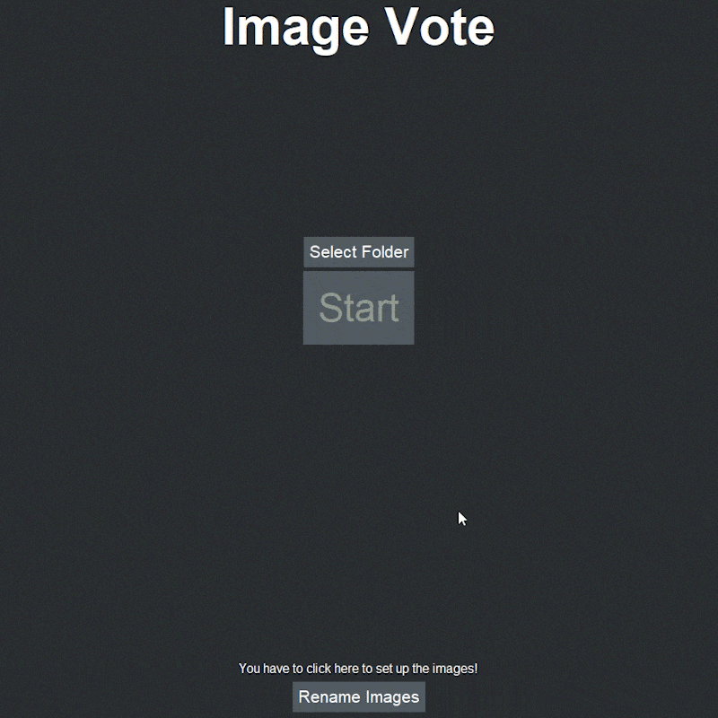

# Image Vote

Image Vote is an interactive program that allows users to blind pick between different variants from sets of images and decide which one looks better. At the end, they will be shown a ranking, with a score representing how each variant performed across all levels. The user can position the image based on the score he wants to give it. The higher the position, the higher the score.

## Features

**Drag-and-Drop Images:** You can drag the images onto the canvas and arrange them in a vertical stack according to your choice. The higher the images are, the higher score they get.

**Multiple Levels:** You can make as many levels as you want for the users to vote.

**Choose between variants:** All levels will have the same variants, but in different scenarios. For example: in the first level, you can compare how cameras **A**, **B** and **C** perform in situation **X**. In the second level, you compare those same cameras in situation **Y**.

**Ranking:** After completing all levels, you can view the final score of each variant and see how they performed.

## Usage Guide

### Setting up the images

To use the poll, a folder of images renamed in a specific format is needed. To rename the files, the user can click the button at the bottom of the starting page to enter the File Renamer page.

Inside the File Renamer, the number of variants and their names can be chosen. At the right, there are buttons to choose the files of each variant. Multiple files can be added at once using the **Files** button, or one by one using **Add 1**. If using **Files**, the selected files have to be sorted alphabetically beforehand. If not sorted, the **Add 1** button should be used. The order they are added define what level they will appear on the poll. When a file is added, a **Remove** button that removes the last file will appear.

After typing the variant names and choosing the files, the files can be renamed by pressing the **Rename** button, and the renamed files will appear inside the **renamed_files** folder that will be created inside the current directory of the program/script. *(PS: you'll get an error if you try to rename the files in the output folder again without moving them to another folder beforehand.)*

### Starting and running the poll

To start the poll, go to the starting page, select the folder with the renamed images and press **Start**.

After loading, the images on the canvas can be dragged onto the slots and they will receive higher scores the higher their positions. The images can be zoomed in for closer inspection by right-clicking on them. After all images are positioned, the **Next** button will be enabled.

When all stages are completed, a ranking with the score of how the image variants performed will appear.

## Python Script

Tested on Python 3.10

### Necessary libraries/modules

- Pillow

- Pygame
